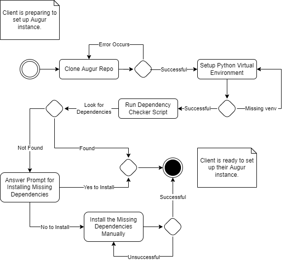
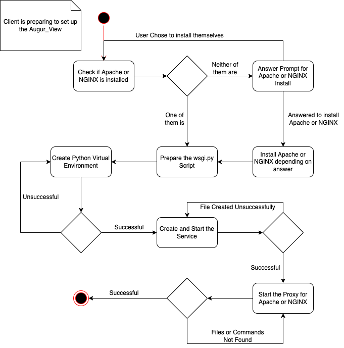
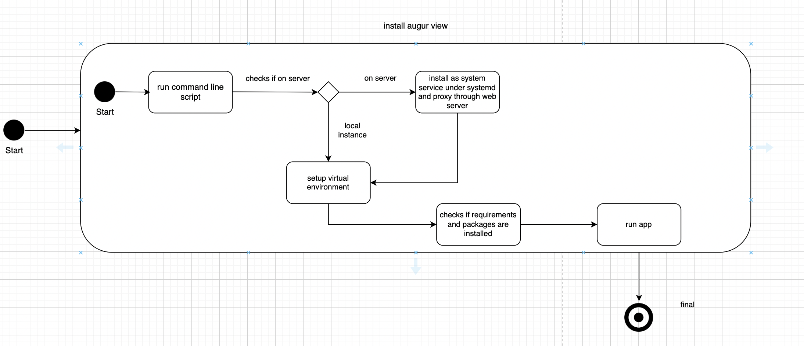

# Design Document

## Augur
### Overview
(Type an overview of the our requirements/project and the diagrams included)

 

### Activity Diagram: Dependency Checker

<this is how you insert a picture into the md>

### Description
(Type a description for the diagram above)

 

### Diagram #2...
(Should probably include a diagram for the augur auto installer)
### Description

 

## Augur View
### Overview
This part of the project is about configuring the Augur_view after the Augur has been installed. The first diagram is the activity diagram of the process of configuring the Augur_view.

 

### Augur View Activity Diagram

### Description:
This is the activity diagram for configuring the Augur_view. The activity will go through and check to see if Apache or NGINX is installed on the system and if it is, it will finish setting up the needed things before configuring the proxy for either Apache or NGINX.

 
  
### Diagram #2...

### Description
This state diagram shows the flow if the scripts involved in installing and setting up the Augur View. It checks if the machine is on a server or not, and if it is then it will install as system service under systemd and proxy it through the web service. Then it will set up the virutal environment, checks if requirements and packages are installed and then it will run the app.
 

## Helpful information
### Various Diagrams
Most applicable to our project:
* Sequence Diagram
* State Diagram
* Activity Diagram

Other diagrams:
* Class Diagram
* ER Diagram
* Use Case
