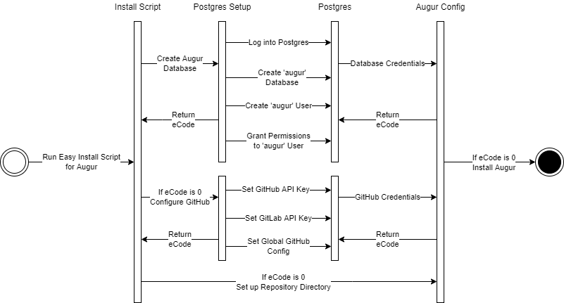
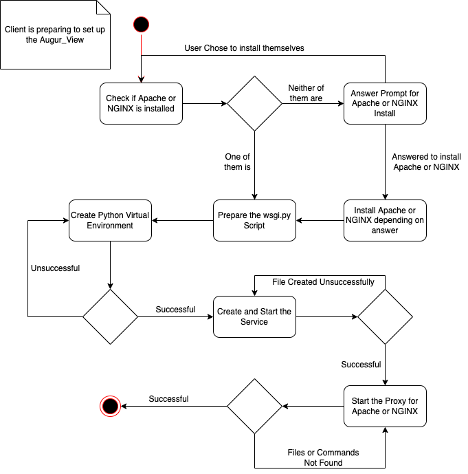

# Design Document

## Augur

### Overview
This part of the project is about configuring Augur.  The first diagram illustrates the process of a client getting ready to set up Augur.  The second diagram illustrates the process of actually installing Augur using the new easy install script.

 

### Activity Diagram: Dependency Checker Script

### Description
This activity diagram demonstrates the process of a client preparing for their Augur instance.  Firstly, they clone the Augur repo and set up the python virtual environment.  Afterward, they can use the dependency checker to detect inconsistencies with their services and those required for the Augur instance.  The script will install the missing services if the client decides to do so.  If not, they will be required to install the services themselves.  The client is now ready to begin the Augur installation.

 

### Sequence Diagram: Easy Install Script

### Description
This sequence diagram demonstrates the process of a client installing Augur after the initial setup from the first diagram.  The client runs the easy install script with a few given parameters, then the script sets up the Augur configuration and installs the Augur instance.

 

## Augur View
### Overview
This part of the project is about configuring the Augur_view after the Augur has been installed. The first diagram is the activity diagram of the process of configuring the Augur_view.

 

### Activity Diagram: Prepare Augur View Setup

### Description:
This is the activity diagram for configuring the Augur_view. The activity will go through and check to see if Apache or NGINX is installed on the system and if it is, it will finish setting up the needed things before configuring the proxy for either Apache or NGINX.

 
  
### State Diagram: Install Script

### Description
This state diagram shows the flow of the scripts involved in installing and setting up the Augur View. It checks if the machine is on a server or not, and if it is then it will install as a system service under systemd and proxy it through the web service. Then it will set up the virtual environment, check if requirements and packages are installed, and then it will run the app.